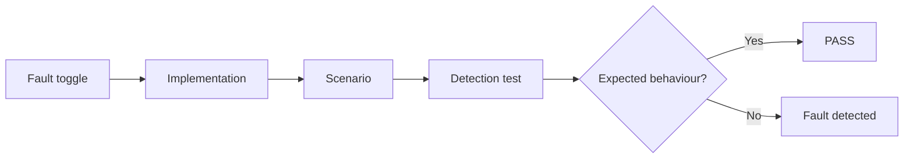
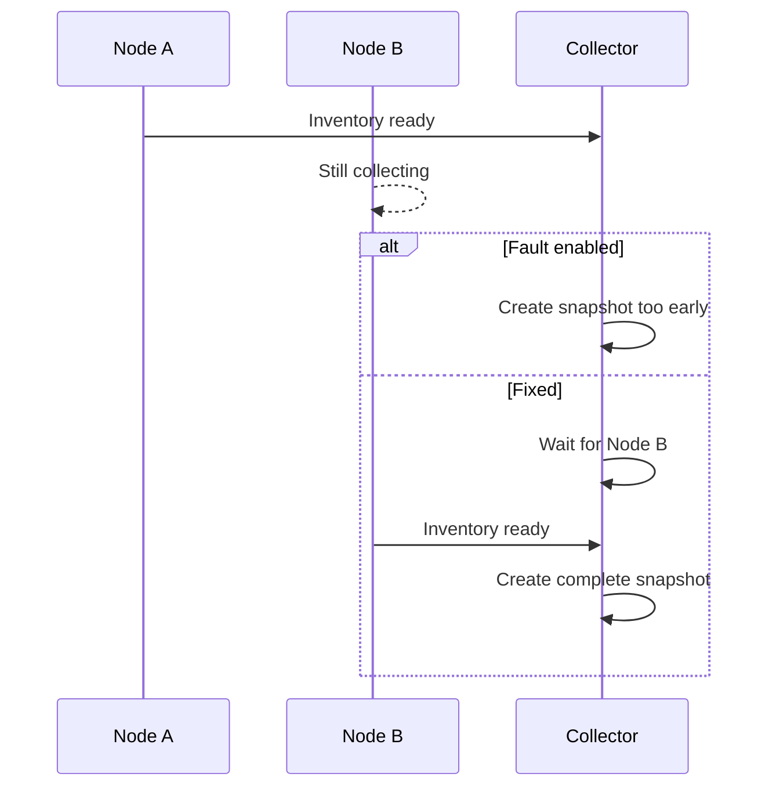

# Fault Injection & Detection

Small Python project demonstrating common concurrency and performance faults
and reliable ways of detecting them.

Each fault can be switched between a fixed and faulty implementation.
The detection suite is built with Pytest and runs automatically in GitHub Actions.

## Faults

| Fault | Status | Detection |
|---|---|---|
| Race condition / premature aggregation | Implemented | Pytest + deterministic synchronization |
| Deadlock | Planned | TODO |
| Thread contention | Planned | TODO |
| I/O contention | Planned | TODO |
| CPU contention | Planned | TODO |

## Project structure

```text
.
├── src/
│   └── amd_tasks/
│       ├── race_condition.py
│       ├── deadlock.py
│       └── contention/
│           ├── thread.py
│           ├── io.py
│           └── cpu.py
│
├── tests/
│   ├── conftest.py
│   ├── test_race_condition.py
│   ├── test_deadlock.py
│   └── contention/
│       ├── test_thread.py
│       ├── test_io.py
│       └── test_cpu.py
│
├── .github/
│   └── workflows/
│       └── ci.yml
│
├── pyproject.toml
└── README.md
```

## How it works



The normal test suite runs against the fixed implementation.

Individual faults can be enabled explicitly from the Pytest command line.
When a fault is enabled, the same behavioural test should detect the injected
problem.

## Setup

Create and activate a virtual environment:

```bash
python3 -m venv .venv
source .venv/bin/activate
```

Install the project and development dependencies:

```bash
python -m pip install --upgrade pip
pip install -e ".[dev]"
```

## Code quality

Run Ruff:

```bash
ruff check .
ruff format --check .
```

Format the code automatically:

```bash
ruff format .
```

## Run tests

Run the normal test suite:

```bash
pytest
```

Run with verbose output:

```bash
pytest -v
```

---

# Race condition — premature inventory aggregation

## Scenario

Two nodes independently collect switch inventory.

The inventory snapshot should be created only after both nodes have finished
collecting their data.



## Root cause

The faulty implementation creates the inventory snapshot before all expected
nodes have completed their work.

There is no synchronization between completion of Node B and the aggregation
step.

## Expected symptom

The published inventory snapshot is incomplete.

Instead of:

```text
node-a
node-b
```

the faulty implementation contains only:

```text
node-a
```

## Fault toggle

The race condition fault is disabled by default.

### Fixed implementation

```bash
pytest tests/test_race_condition.py
```

Expected result:

```text
PASS
```

### Faulty implementation

Enable the fault with:

```bash
pytest tests/test_race_condition.py --race-fault
```

Expected result:

```text
FAIL
```

The failure is expected because the test detects the incomplete inventory
snapshot.

## Detection

The test defines one invariant:

```text
The inventory snapshot must contain every expected node.
```

The same test is executed against both implementations.

With the fixed implementation:

```text
expected: node-a, node-b
actual:   node-a, node-b
result:   PASS
```

With the fault enabled:

```text
expected: node-a, node-b
actual:   node-a
result:   FAIL — fault detected
```

The scenario uses `threading.Event` to control when Node B can finish.

No `sleep()` or timing assumptions are used, making the fault deterministic
and repeatable.

---

# Deadlock

TODO.

This section will describe:

- Scenario
- Root cause
- Expected symptom
- Fault toggle
- Detection method

---

# Thread contention

TODO.

---

# I/O contention

TODO.

---

# CPU contention

TODO.

---

# Continuous Integration

GitHub Actions runs code quality checks and the normal test suite on pushes
and pull requests.

The CI pipeline checks:

```text
Ruff lint
    ↓
Ruff formatting
    ↓
Pytest
```

Fault-injection checks are executed separately to verify that the detection
suite actually detects an enabled fault.

## Race condition detection

Normal implementation:

```bash
pytest tests/test_race_condition.py
```

Injected fault:

```bash
pytest tests/test_race_condition.py --race-fault
```

The injected run is expected to produce a failing test. CI treats that expected
failure as confirmation that the detector works.
